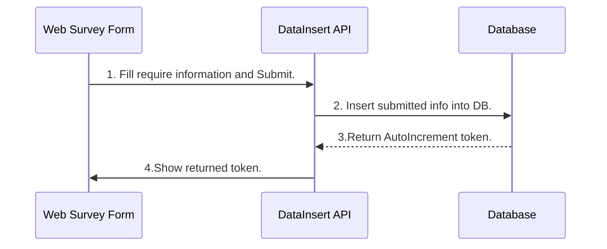

# Generate Token App

This app is sample generate token when fill the name, phone, company name and designation.

**MySql** database is use for store the data.
**Nodejs and Express** is use for backend api.
**React** is use for the fontend.


# To Run in local

- First go to the backend folder and run
	Run the command to install the require dependency.
	
	```npm install```
	
	and run
	
	```
	npm run seed
	npm run dev
	``` 
- And to the fontend/token_generator folder and run
	Run the command to install the require dependency.

	```npm install ```

	and run 

	```npm install ```
					
	
## Workflow Sequence Diagram





